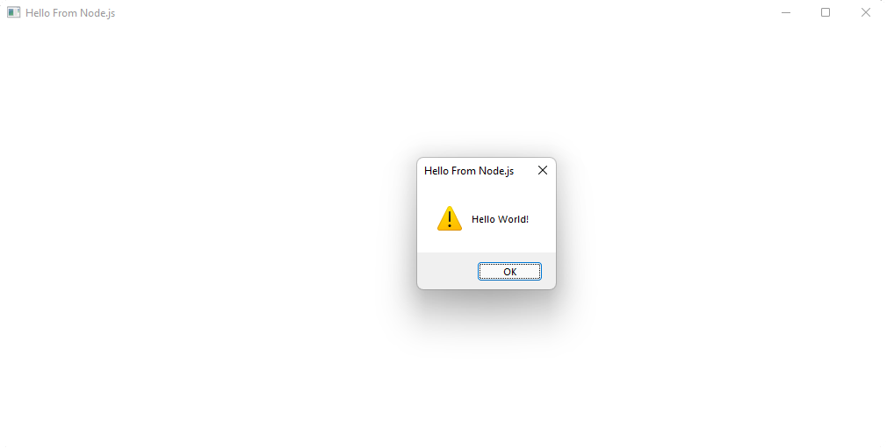
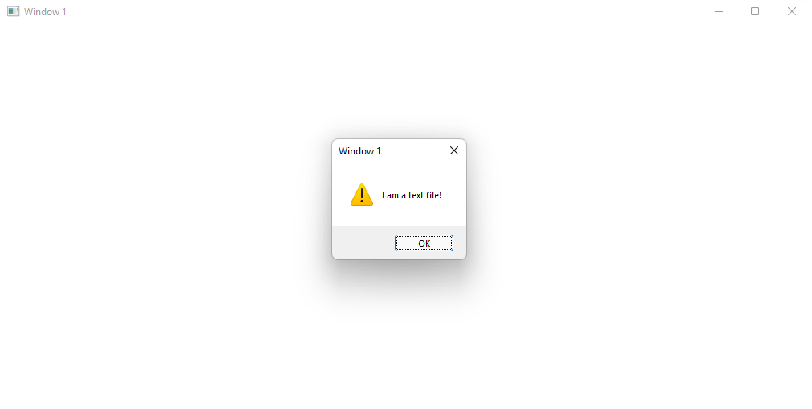

# JSWind

🪟 Create desktop windows in node.js

✏️ Easy to use

## Install

In your command line, run:

```bash
$ npm install jswind
```

## Use

In your JavaScript file, require jswind like so:

```js
const DesktopWindow = require("jswind");
```

`DesktopWindow` is a class that creates, you guessed it, desktop windows. Create one by creating a new instance of `DesktopWindow` and adding a control function, and an optional title:

```js
const window = new DesktopWindow(() => {
  alert("Hello World!");
}, "Hello From Node.js");
```

you will get something like this:



The control function is like JavaScript running in the browser, you have full access to the dom. But what if you want to write a file, or create an http server?

### Events

You can create events for the window that can be triggered from inside the control function. To create an event, run this function from your `DesktopWindow` instance:

```js
window.addEvent("Event Name", function callback(argument) {});
```

Then to run an event, in the control function use the function:

```js
eventSend("Event Name", argument);
```

In my case, I will create a file titled `text.txt` that says:

```txt
I am a text file!
```

Then I will create the following code to alert the text in the file:

```js
const DesktopWindow = require("jswind");
const { readFileSync } = require("fs");

const window = new DesktopWindow(async () => {
  const text = await eventSend("getText");
  alert(text);
});

window.addEvent("getText", () => {
  return readFileSync("text.txt", "utf-8");
});
```

Then when I run the file, I'll get:



You can also use built in events from outside of this window using `.on`:

```js
window.on("event", function callback() {});
```

<table>
  <tr>
    <th>Events</th>
  </tr>
  <tr>
    <td><code>close</code></td>
    <td>When the window closes, can exit the process by adding <code>DesktopWindow.EXIT_ON_CLOSE</code></td>
  </tr>
</table>

### Executables (pkg)

You can create a JSWind project by running jswind on `npx`:

```bash
$ npx jswind
```

You should have a directory like this:

```
> instances
> jswind
> src
# .gitignore
# index.js
# package.json
```

Start your code in `index.js`. Everything works the same accept instead of inputting functions when creating a new `DesktopWindow`, you put in strings of functions. _this is because `Function.toString()` in an executable will turn into `"[ native code ]"`_

You can run the pkg script to turn the project into an executable:

```bash
$ npm run pkg
```
